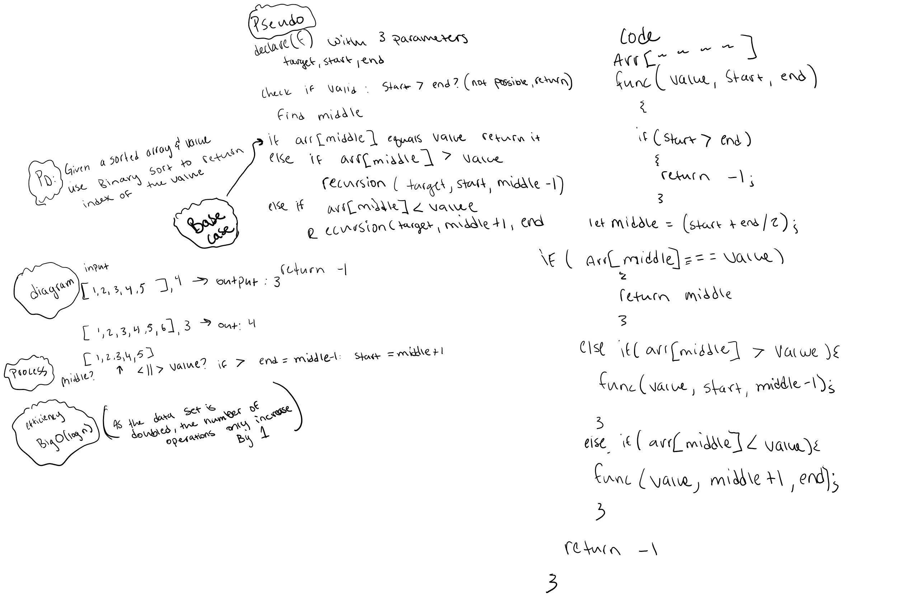

# Binary Search of Sorted Array

Write a function called BinarySearch which takes in 2 parameters: a sorted array and the search key. Without utilizing any of the built-in methods available to your language, return the index of the array’s element that is equal to the value of the search key, or -1 if the element is not in the array.

## Whiteboard Process

## Approach & Efficiency

Big O(log n) MEANING as the data set is doubled the number of operations to satisfy the scaling is increased by 1. O log n is one of the most efficient algorithm efficiencies you can have on an algorithm for big data.