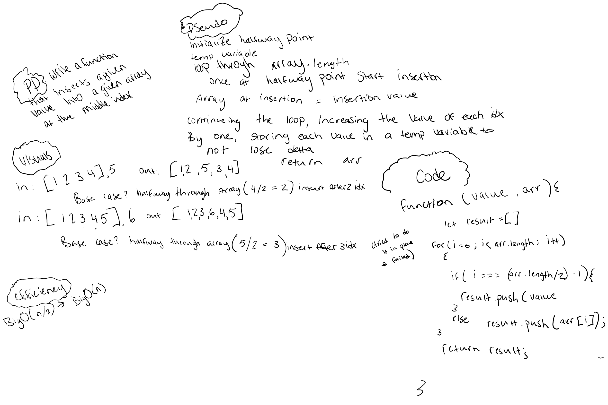

# Insert to Middle of an Array

Write a function called insertShiftArray which takes in an array and a value to be added. Without utilizing any of the built-in methods available to your language, return an array with the new value added at the middle index.

```js
Input	Output
[2,4,6,-8], 5	 ->[2,4,5,6,-8]
[42,8,15,23,42], 16 ->[42,8,15,16,23,42]
```

## Whiteboard Process



## Approach & Efficiency
Big O(n/2) -> Big O(n)